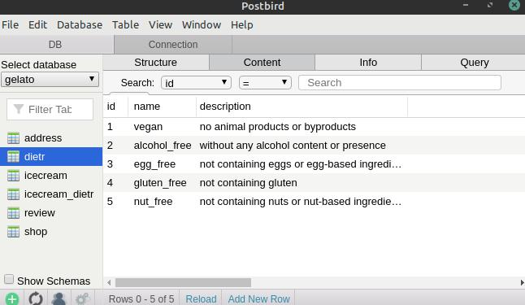

# PostgreSQL Gelato Database

In this project, I design a database of ice cream shops that sell products appropriate for people with dietary requirements.

I decided to create this project to practice PostgreSQL, Database design, Web scraping, and Data Wrangling.

I chose this project because people close to me have dietary requirements, so I find the topic interesting (I was also inspired by the [Two Scoops Django book](https://www.feldroy.com/books/two-scoops-of-django-3-x)), and because the dietary requirements allow me to have all three types of relationships in one small project: 
- **many-to-many** for the ice creams that comply with multiple dietary requirements, 
- **one-to-many** for the reviews done to each icecream flavour, and 
- **one-to-one** for the address of each icecream shop.

I use as a guide [flavours listed in Messina's website](./media/inspiration.jpg) (see my web scraper project [here](https://github.com/lmponcio/web-scraper-gelato)).

### Preliminary work - DB design 
I used [draw.io](http://draw.io/) to design the schema.

### Tables creation
I used Postbird Client to access my PostgreSQL database. Below a screenshot of the [queries for creating the tables](./create_tables.sql).

### Filling tables
I used [python for writing the INSERT queries](./insert_dietrs.py). 
<!-- TO ADD 
The data for writing the query was extracted from an excel file (accessed it with [openpyxl](https://openpyxl.readthedocs.io/en/stable/index.html)) - this data comes from [my previous web scraper project](https://github.com/lmponcio/web-scraper-gelato). 
-->

### Bibliography
- Learned PostgreSQL at [Design Databases with PostgreSQL by Codecademy](https://www.codecademy.com/learn/paths/design-databases-with-postgresql)
- Diagram notation from https://vertabelo.com/blog/crow-s-foot-notation-in-vertabelo/
- Diagrams drawn with http://draw.io/
- Icecream flavours from https://gelatomessina.com/collections/classic-flavours
