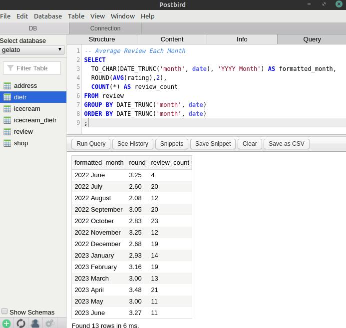
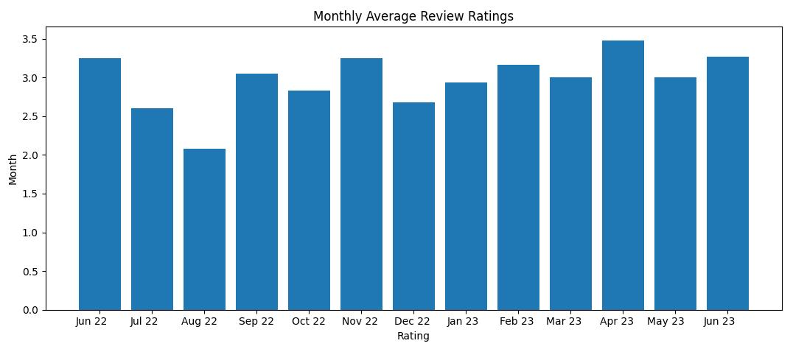
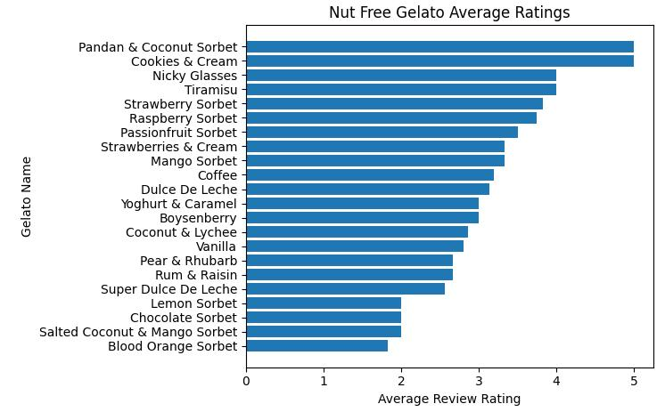

# PostgreSQL Gelato Database

In this project, I design a database of ice cream shops that sell products appropriate for people with dietary requirements.

I decided to create this project to practice PostgreSQL, Database design, SQL Querying, Web scraping, and Data Wrangling.

I chose this project because I find the topic interesting (also inspired by the [Two Scoops Django book](https://www.feldroy.com/books/two-scoops-of-django-3-x) and [Messina's website](./media/inspiration.jpg)), and because the dietary requirements allow me to have all three types of relationships in one small project: 
- **many-to-many** for the ice creams that comply with multiple dietary requirements, 
- **one-to-many** for the reviews done to each icecream flavour, and 
- **one-to-one** for the address of each icecream shop.

### Database Design 
I used [draw.io](http://draw.io/) to design the schema.


### Tables creation
I used Postbird Client to access my PostgreSQL database. Below a screenshot of the [queries for creating the tables](./create_tables.sql).


### Filling tables
I used [python for writing the INSERT statements](./insert_icecreams.py) (I saved myself from writing hundreds of lines of SQL code manually - see SQL [here](./insert_icecream_dietrs.sql)). Below is a screenshot of the cross reference table for the many-to-many relationship between flavours and dietary requirements.


For the reviews table [I created random reviews with Python](./insert_reviews.py) to have data to work with. Please see below a screenshot of the Database Table after the [data](./insert_reviews.sql) was inserted:


### Querying

I executed the following [queries](./queries.sql) shown below. I thought of queries to respond to questions that explain the data:
- Which one is the flavor with the best reviews?
- How about the best rating of a specific group (or diet requirement)?
- Have people given reviews consistently throughout time? Where is the peak?

```
-- Nut-free Icecream with Best Average Rating
SELECT 
	icecream.name, 
  ROUND(AVG(review.rating),2) AS average_rating,
  COUNT(*) AS review_count
FROM review
JOIN icecream ON icecream.id = review.icecream_id 
JOIN icecream_dietr ON icecream_dietr.icecream_id = icecream.id
JOIN dietr ON dietr.id = icecream_dietr.dietr_id
WHERE dietr.name = 'nut_free'
GROUP BY icecream.name
ORDER BY average_rating DESC
;

-- Dietary requirements with highest Average Rating
SELECT 
	dietr.name, 
  ROUND(AVG(review.rating),2) AS average_rating, 
  COUNT(*) AS review_count
FROM dietr
JOIN icecream_dietr ON dietr.id = icecream_dietr.dietr_id
JOIN icecream ON icecream_dietr.icecream_id = icecream.id 
JOIN review ON  icecream.id = review.icecream_id
GROUP BY dietr.name
ORDER BY average_rating DESC
;

-- Icecream with Best Average Rating
SELECT 
	icecream.name, 
  ROUND(AVG(review.rating),2) AS average_rating,
  COUNT(*) AS review_count
FROM review
JOIN icecream
ON icecream.id = review.icecream_id 
GROUP BY icecream.name
ORDER BY average_rating DESC
;

-- Average Review Each Month
SELECT 
	TO_CHAR(DATE_TRUNC('month', date), 'YYYY Month') AS formatted_month, 
  ROUND(AVG(rating),2), 
  COUNT(*) AS review_count
FROM review
GROUP BY DATE_TRUNC('month', date)
ORDER BY DATE_TRUNC('month', date)
;

```
Please find below an image of the output of one of the queries in Postbird.



### Visualization

I used pandas and matplotlib to create visualizations of the previously written queries. Please see below two of the visualizations:

Monthly average ratings (see code [here]("./visualization_month_avg.py"))



Nut-free gelato average ratings (see code [here]("./visualization_nut_free_rating.py"))



### Bibliography
- Learned PostgreSQL at [Design Databases with PostgreSQL by Codecademy](https://www.codecademy.com/learn/paths/design-databases-with-postgresql)
- Diagram notation from https://vertabelo.com/blog/crow-s-foot-notation-in-vertabelo/
- Diagrams drawn with http://draw.io/
- Icecream flavours from https://gelatomessina.com/collections/classic-flavours - See my Web Scraper [Here](https://github.com/lmponcio/web-scraper-gelato) 
