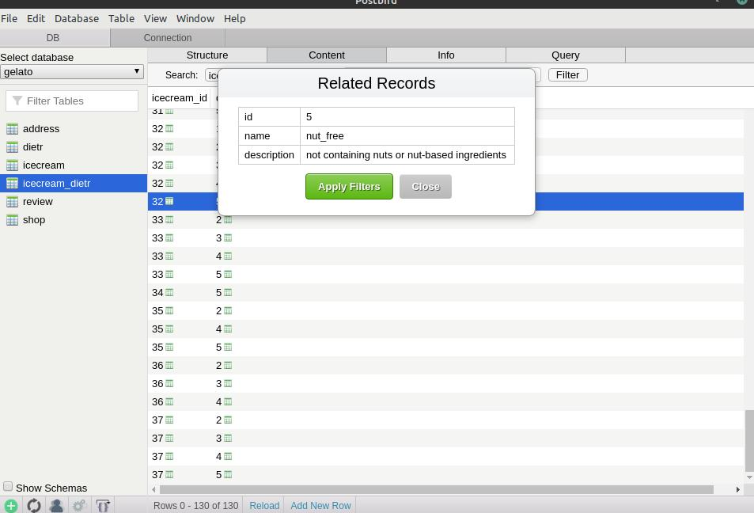

# PostgreSQL Gelato Database

In this project, I design a database of ice cream shops that sell products appropriate for people with dietary requirements.

I decided to create this project to practice PostgreSQL, Database design, SQL Querying, Web scraping, and Data Wrangling.

I chose this project because I find the topic interesting (also inspired by the [Two Scoops Django book](https://www.feldroy.com/books/two-scoops-of-django-3-x) and [Messina's website](./media/inspiration.jpg)), and because the dietary requirements allow me to have all three types of relationships in one small project: 
- **many-to-many** for the ice creams that comply with multiple dietary requirements, 
- **one-to-many** for the reviews done to each icecream flavour, and 
- **one-to-one** for the address of each icecream shop.

### Database Design 
I used [draw.io](http://draw.io/) to design the schema.

### Tables creation
I used Postbird Client to access my PostgreSQL database. Below a screenshot of the [queries for creating the tables](./create_tables.sql).

### Filling tables
I used [python for writing the INSERT queries](./insert_icecreams.py) (I saved myself from writing hundreds of lines of SQL code manually - see SQL [here](./insert_icecream_dietrs.sql)). Below is a screenshot of the cross reference table for the many-to-many relationship between flavours and dietary requirements.

For the reviews table [I created random reviews with Python](./insert_reviews.py) to have data to work with. Please see below a screenshot of the Database Table after the [data](./insert_reviews.sql) was inserted:

### Bibliography
- Learned PostgreSQL at [Design Databases with PostgreSQL by Codecademy](https://www.codecademy.com/learn/paths/design-databases-with-postgresql)
- Diagram notation from https://vertabelo.com/blog/crow-s-foot-notation-in-vertabelo/
- Diagrams drawn with http://draw.io/
- Icecream flavours from https://gelatomessina.com/collections/classic-flavours - See my Web Scraper [Here](https://github.com/lmponcio/web-scraper-gelato) 
